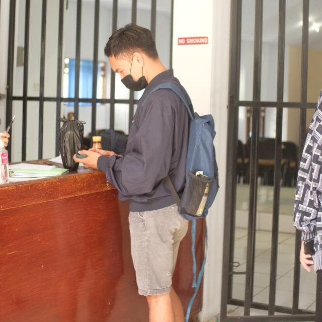

# 👋 Hi there!

I'm **JodieJB**, a passionate developer and tech enthusiast. Welcome to my GitHub profile!

---

## 🌐 Connect With Me

You can find me on these platforms:

---

## 👨‍💻 About Me

- 🎓 Passionate learner and technology enthusiast
- 💻 Interested in web development and open source projects
- 🌱 Currently exploring new technologies
- ⚡ Love collaborating with creative minds
- 📍 Location: [Your City, Country]

---

# 💻 Tech Stack:
    
# 📊 GitHub Stats:
 
 

---
## 🛠️ Skills & Technologies

**Languages:**
- JavaScript/TypeScript
- Python
- HTML & CSS
- [Add more...]

**Frameworks & Tools:**
- React / Vue.js
- Node.js
- Git & GitHub
- [Add more...]

**Other Skills:**
- Problem Solving
- Team Collaboration
- Project Management

---

## 📊 GitHub Stats

---

## 🏆 GitHub Trophies

---

## 📁 Featured Projects

### 🎯 Project 1: [Project Name]
- **Description**: [Brief description of your project]
- **Tech Stack**: JavaScript, React, Node.js
- **Link**: [Link to repository]

### 🎯 Project 2: [Project Name]
- **Description**: [Brief description of your project]
- **Tech Stack**: Python, Flask
- **Link**: [Link to repository]

### 🎯 Project 3: [Project Name]
- **Description**: [Brief description of your project]
- **Tech Stack**: HTML, CSS, JavaScript
- **Link**: [Link to repository]

---

## 📈 My Interests

- 💡 Web Development
- 🤖 Machine Learning
- 📱 Mobile Development
- 🎨 UI/UX Design
- 🔐 Cybersecurity

---

## 🎯 Goals for 2026

- [ ] Contribute more to open source projects
- [ ] Learn advanced concepts in [Technology]
- [ ] Build 3+ impactful projects
- [ ] Help others in the tech community

---

## 📝 Latest Blog Posts

<!-- You can add blog posts here -->
- [Post Title](link)
- [Post Title](link)

---

## 💬 Fun Fact

> "Coding is like writing poetry – you need creativity and logic!"

---

## 📞 Get In Touch

- 💼 Open to collaborations and freelance work
- 🤝 Happy to help with projects
- 📧 Email: your.email@example.com

---

### Thanks for visiting my profile! ⭐

Feel free to explore my repositories and don't hesitate to reach out!

